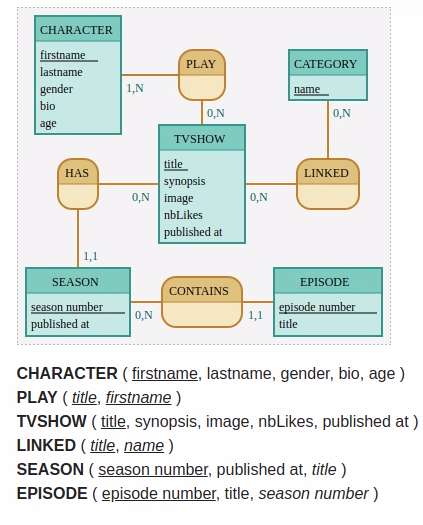

# Projet Oflix

## Supports de cours associés

- [Doctrine Associations](https://symfony.com/doc/current/doctrine/associations.html)
- [Lien vers la fiche récap Doctrine Associations](https://kourou.oclock.io/ressources/fiche-recap/symfo-s2-j2-associations-avec-doctrine/)

## Challenge 

D'après le MCD suivant :

```
TVSHOW : title, synopsis, image, nbLikes, published at

SEASON : season number, published at
HAS, 0N TVSHOW, 11 SEASON

EPISODE : episode number, title
CONTAINS, 0N SEASON , 11 EPISODE


CHARACTER : firstname, lastname, gender, bio, age
PLAY, 0N TVSHOW, 1N CHARACTER

CATEGORY : name
LINKED, 0N TVSHOW, 0N CATEGORY
```



### Démarrage 

- On part d'un nouveau Projet en Website skeleton : `composer create-project symfony/website-skeleton oflix`
- Ensuite on configure le fichier `.env.local` (Vous pouvez nommer la DB `oflix`)
- Puis création de ta DB : `php bin/console doctrine:database:create`

### Création des entités

- Créez toutes les entités du MCD à l'aide de la commande `php bin/console make:entity`

#### TvShow

- `title`
- `synopsis`
- `image` (url de l'image)
- `nbLikes`
- `publishedAt`
- `createdAt`
- `updatedAt`

#### Season

- `seasonNumber`
- `publishedAt`
- `createdAt`
- `updatedAt`

#### Episode

- `episodeNumber`
- `title`
- `publishedAt`
- `createdAt`
- `updatedAt`

etc...

Puis lancez la commande suivante : `php bin/console doctrine:schema:update --force`

### Relations OneToMany / ManyToOne

Créez les relations entre : 

- `TvShow` et `Season` : Une série peut avoir plusieurs saisons.
- `Season` et `Episode` : Une saison peut avoir plusieurs épisodes.

Puis lancez la commande suivante : `php bin/console doctrine:schema:update --force`

### Relations ManyToMany

Créez les relations entre `TvShow`, `Character` et `Category`

- `TvShow` et `Character` : Une série peut avoir plusieurs personnages, et 1 personnage peut joueur dans plusieurs séries.
- `TvShow` et `Category` :  Une série peut avoir plusieurs catégories, et 1 catégorie peut être associée à plusieurs séries.

Puis lancez la commande suivante : `php bin/console doctrine:schema:update --force`

### Lecture et affichage

Si vous voulez démarrer avec quelques données, créez-en vous-même depuis Adminer ou PhpMyAdmin.

- Afficher la liste des 3 dernières séries depuis la page d'accueil (regarder du côté de `findBy`). URL = `/`.
- Afficher la liste des séries (TvShow) depuis la page des séries. URL = `/tvshow/`.
- Afficher les détails d'une série. URL = `/tvshow/{id}`.
  - Pour chaque série, affichez les saison`S`, les personnage`S` et les catégorie`S` associés... Ca sent la boucle `for` on dirait :wink:

## Bonus intégration

Dans le dossier [`docs`](docs) se trouve l'intégration du projet `oFlix` :tada:.
On y trouve
- Une page d'accueil qui servira de point d'entrée : `/`
- Une page `Séries` qui affichera les dernières séries publiées : `/tvshow/`
- Une page affichant les détails d'une série selon son ID : `/tvshow/{id}`
- Une page `Ma liste` qui affichera vos séries préférées : `/tvshow/favorite`
- Une page de `Login` pour accéder aux contenus réservées aux personnes connectées (A ne surtout pas coder pour le moment ^^)

Votre mission : l'inclure pour apporter un peu de couleur au projet actuel.

P.S. : on inclurera d'autres pages au fur et à mesure
